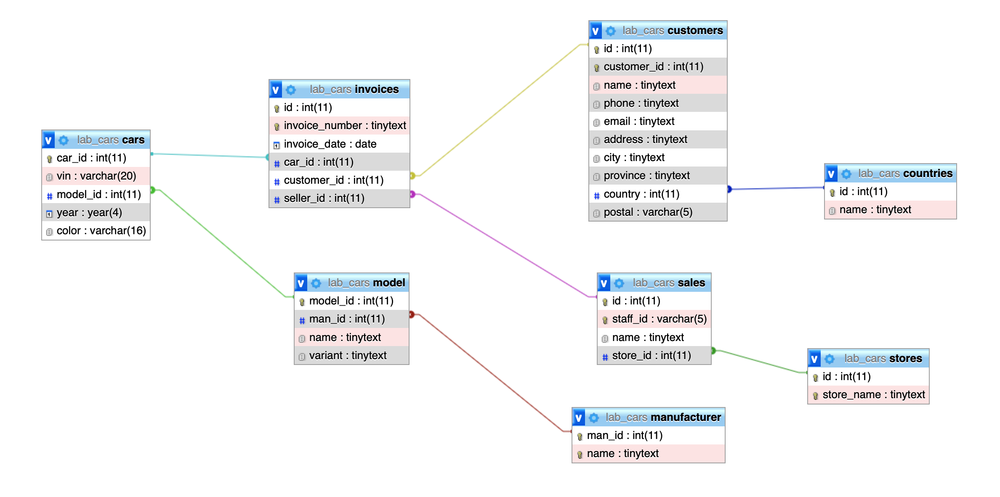

## Intro to MySQL

#### 1. Diagram

Tables

**cars**  
- car_id: index, auto_increment  
- vin: varchar(20)  
- model_id: int, index -> model.model_id  
- year: year  
- color: varchar(16)  

**model**  
- model_id: index, auto_increment  
- man_id: int, index -> manufacturer.man_id  
- name: tinytext(255)
- variant: tinytext(255)

**invoices**  
- id: index, auto_increment  
- invoice_number: tinytext(255)  
- invoice_date: date  
- car_id: int, index -> cars.car_id  
- customer_id: int, index -> customers.id  
- seller_id: int, index -> sales.id

**customers**  
- id: index, auto_increment  
- customer_id: int, unique  
- name: tinytext(255)  
- phone: tinytext(255)  
- email: tinytext(255)  
- address: tinytext(255)  
- city: tinytext(255)  
- province: tinytext(255)  
- country: int, index -> countries.id  
- postal: varchar(5)

**sales**  
- id: index, auto_increment  
- staff_id: varchar(5), unique  
- name: tinytext(255)  
- store_id: int, index -> stores.id  

**stores**  
- id: int, auto_increment  
- store_name: tinytext(255)

**manufacturer**  
- model_id: int, auto_increment  
- name: tinytext(255)  

#### 2. Creating the database

> [create.sql](create.sql)

### 3. Seeding the database

> [seeding.sql](seeding.sql)

### 4. Updating and deleting database records

> [update.sql](update.sql)  
> 
> [delete.sql](delete.sql)